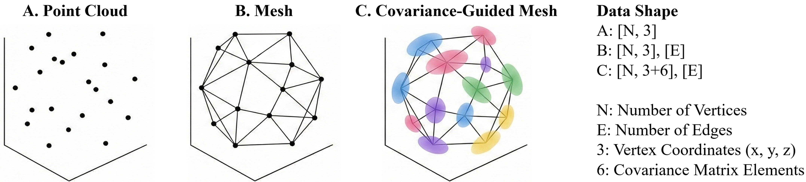
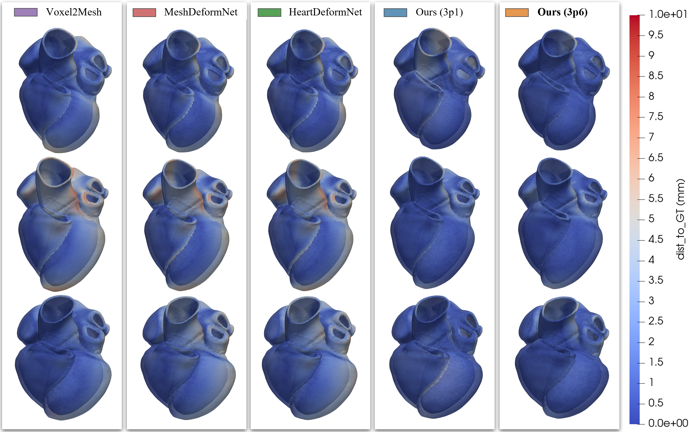
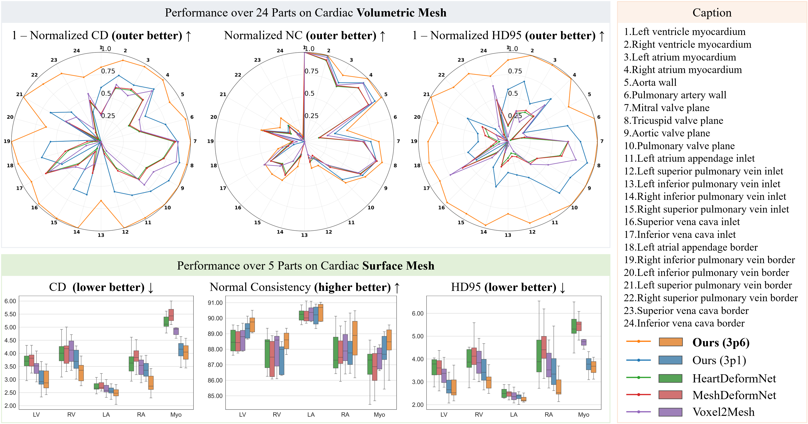

# HeartVolMesh

**Cardiac Volumetric Mesh Reconstruction via Covariance-Guided Graph Deformation**

> From 3D CTA volumes to simulation-ready tetrahedral heart meshes, **HeartVolMesh** combines covariance-guided graph deformation with template-driven volumetric warping to preserve topology, correspondence, and downstream simulation utility.
>
> **Status:** The manuscript is currently under peer review. This repository currently provides a project overview only, and **the code will be released after the paper is published**.


*Overview of HeartVolMesh. A covariance-guided image-to-surface module predicts the target boundary, and a template-driven volume-to-surface registration stage converts it into a patient-specific tetrahedral mesh.*

## Overview

HeartVolMesh is a project for reconstructing patient-specific **tetrahedral cardiac meshes** directly from **3D CTA volumes**. The method is designed for simulation-oriented applications such as cardiac digital twins and in-silico studies, where a surface mesh alone is not sufficient.

Compared with conventional segmentation-then-meshing pipelines, HeartVolMesh aims to:

- preserve thin-wall anatomical details and multi-structure junctions,
- maintain topology consistency during reconstruction,
- generate volumetric meshes with cross-case correspondence,
- support downstream FEM/CFD-style simulation workflows.

## Key contributions

1. **Covariance-guided graph deformation**  
   Each template vertex is lifted from a deterministic point to an anisotropic Gaussian representation, enabling direction-aware geometric modelling instead of relying only on uniform Euclidean supervision.

2. **Template-driven volumetric meshing**  
   A high-quality tetrahedral template is aligned to the predicted surface and deformed through a dense deformation field, preserving connectivity and enabling cross-case correspondence.

3. **Whole-heart validation**  
   The framework is evaluated in multi-structure cardiac reconstruction and shows consistent gains in both surface-mesh accuracy and volumetric boundary fidelity, together with strong element quality.

## Method



*HeartVolMesh extends a standard mesh representation to ` [x, y, z] + 6 covariance parameters `, allowing local anisotropy to be learned directly from volumetric images.*

The pipeline contains three main stages:

1. **Image-conditioned vertex features**  
   A 3D CNN extracts multi-scale volumetric features, which are sampled at current vertex positions and propagated over the mesh graph with a GNN.

2. **Coarse-to-fine surface prediction**  
   The mesh is progressively refined across stages. The final head predicts both vertex displacements and covariance parameters for covariance-guided surface reconstruction.

3. **Surface-to-volume propagation**  
   Surface motion is converted into a dense deformation field and applied to every vertex of a tetrahedral template, yielding a volumetric mesh whose boundary matches the reconstructed patient-specific surface.

## Experimental setting

- **Dataset:** multi-centre in-house dataset with **900 patients** and **4,000 temporal instances**
- **Split:** **800 patients / 3,600 instances** for training and **100 patients / 400 instances** for validation
- **Training:** single **NVIDIA A100 80GB** GPU, Adam optimizer, 100 epochs, batch size 1
- **Input crop:** `128^3`
- **Deformation field resolution:** `300^3`

## Qualitative results



*Qualitative comparison of boundary surfaces extracted from the final tetrahedral meshes. HeartVolMesh produces sharper boundaries and fewer outliers, especially near inter-structure junctions.*

## Quantitative summary



### Key mesh-quality statistics

- **0.0%** inverted elements across **400** validation instances
- **Minimum scaled Jacobian:** `0.0416 ± 0.0152`
- **Minimum dihedral angle:** `5.56° ± 1.41°`

### Best surface-mesh results (Ours 3p6)

| Structure | CD ↓ | HD95 ↓ | NC ↑ |
| --- | ---: | ---: | ---: |
| LA | 2.5 | 2.2 | 89.5% |
| LV | 3.0 | 2.8 | 88.7% |
| Myo | 4.0 | 3.6 | 87.6% |
| RA | 2.9 | 2.8 | 88.3% |
| RV | 3.3 | 3.1 | 87.3% |

### Best volumetric-boundary results (Ours 3p6)

| Structure | CD ↓ | HD95 ↓ | NC ↑ |
| --- | ---: | ---: | ---: |
| LVMyo | 3.6 | 3.2 | 95.3% |
| RVMyo | 3.1 | 2.8 | 94.2% |
| LAMyo | 3.0 | 3.0 | 87.7% |
| RAMyo | 3.0 | 2.9 | 92.2% |

## Key takeaways

- **Better boundary localization:** covariance-guided supervision improves robustness in ambiguous and thin anatomical regions.
- **Volumetric meshes with correspondence:** deforming a fixed tetrahedral template preserves connectivity and enables cross-case vertex correspondence by design.
- **Simulation-oriented flexibility:** the template-conditioned formulation can support different mesh densities and element specifications when an appropriate template is provided.

## Release plan

This repository is intentionally limited to a project overview during the review stage.

- **Paper:** currently under peer review
- **Code:** to be released **after the paper is published**
- **Additional materials:** will be updated after publication as appropriate

## Citation

```bibtex
@misc{heartvolmesh2026,
  title = {HeartVolMesh: Cardiac Volumetric Mesh Reconstruction via Covariance-Guided Graph Deformation},
  note  = {Manuscript under review. Citation details will be updated after publication.}
}
```

## Acknowledgements

> **This project was supported by the NVIDIA Academic Grant Program.**  
> We sincerely thank NVIDIA for the academic grant support and computational resources that helped make this work possible.
